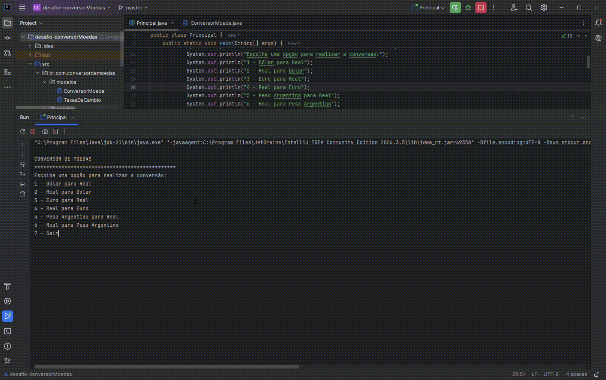

# Challenge Conversor de Moedas 💱

Projeto simples e funcional para praticar o consumo de **APIs REST** em Java, com leitura de dados JSON e interação via **console**. Desenvolvido como parte do programa de formação em tecnologia da **Alura + Oracle Next Education**.

---

## Funcionalidades

Este conversor permite ao usuário escolher entre diferentes moedas e realizar conversões com base em **valores atualizados em tempo real**, utilizando uma API externa de câmbio.

- Projeto executado totalmente no console
- Menu com 6 opções de conversão
- Conversões baseadas em taxas reais
- Estrutura orientada a objetos com boas práticas

---

## API ExchangeRate

Os dados são obtidos da API gratuita:

🔗 [ExchangeRate API](https://www.exchangerate-api.com/docs/overview)

Para usar, é necessário gerar uma **chave de API** gratuita no site.

---

## Demonstração

📽️ *Exemplo do funcionamento da aplicação no console:*

  

---

## Como Executar o Projeto

1. Clone este repositório:
   ```bash
   git clone https://github.com/seu-usuario/seu-repositorio.git
   ```
2. Importe o projeto no IntelliJ IDEA (ou sua IDE preferida)  
3. Configure a variável de ambiente com sua chave da API:
   - `API_KEY=suachaveaqui`
4. Execute a classe `Principal.java` para iniciar

---

## Créditos

Este projeto foi proposto como desafio pelo programa:

- [Oracle Next Education](https://www.oracle.com/br/education/oracle-next-education/)
- [Alura - Cursos de tecnologia](https://www.alura.com.br/)

---

## Licença

Projeto de uso educacional, livre para estudos e modificações.

---

Desenvolvido com ☕ por Cristielle Reis
